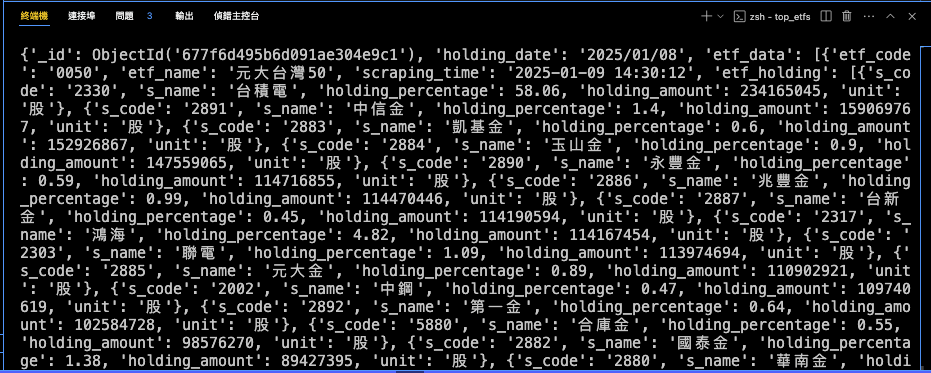

#### __其他語言版本:__ [[English]](README.md)  

# **tagui_demo_02**

## **RPA: 使用「RPA for Python」建立一個排程以定期地抓取網頁資料**

### **Ⅰ. 目的** 
TagUI是一個開源(open-source)的機器人流程自動化工具。「RPA for Python」是基於TagUI所建立的一個python套件。本專案的內容是展示一個例子去使用「RPA for Python」建立一個排程以定期地抓取網頁資料。  

### **Ⅱ. 工具**
RPA for Python、APScheduler (Advanced Python Schedule)、MongoDB  

### **Ⅲ. 說明**

__1. 抓取資料__  

目標抓取資料是台灣的 ETF (exchange-traded funds)，被翻譯為 指數股票型基金 或 交易所交易基金 或 交易型開放式指數基金。近幾年台灣ETF蓬勃發展，ETF種類眾多，本專案選擇主要投資股票且資產規模超過1000億台幣的ETF，共8檔ETF，證券代號分別為：0050、00878、0056、00919、00929、006208、00940、00713。 
另外，ETF排行請參考Yahoo股市 ([詳見](<https://tw.stock.yahoo.com/tw-etf/total-assets>))。 
  

__2. 資料來源__  

非常感謝網站「口袋證券」，其ETF專區網址為「 https://www.pocket.tw/etf/ 」。該公司是台灣最好的網路券商之一，提供多項良好的服務，網站提供投資人方便地取得財經資料及有用的資訊。 
 

__3. 程式運作__  

APScheduler是一個輕量級的Python任務定時執行模組或套件，它可以安排需要定時執行的任務。
網頁操作由「RAP for Python」執行，然後APScheduler能安排此網頁操作定時地執行。如同python程式碼所示 ([rpa_scrap_etf.py](./rpa_scrap_etf.py))，將安排每天從18:00到20:00每10分鐘執行一次。 
  

__4. 結果__  

Python程式碼將解析HTML的內容、處理資料，然後寫進JSON檔案中。(內容請參考 [etfs_holding.json](./outputs/etfs_holding.json)) 
此外，資料也將被更新到MongoDB資料庫。檢查資料是否已匯入資料庫可以執行另一個python檔案(詳見「[save_db.py](./save_db.py)」)，query的內容將可顯示在終端視窗如下。 

  

__以上提供一個例子去使用「RPA for Python」建立一個排程以定期地抓取網頁資料。__  

(個人相似專案 [tagui_demo_01](<https://github.com/qinglian1105/tagui_demo_01>) 、 [uipath_demo_01](<https://github.com/qinglian1105/uipath_demo_01>) 、 [power_automate_demo_01](<https://github.com/qinglian1105/power_automate_demo_01>) 請參考) 
(網路爬蟲專案 [playwright_multitasking_demo_01](<https://github.com/qinglian1105/playwright_multitasking_demo_01>) 請參考)
  

---

### **Ⅳ. References**

[1] [TagUI](<https://tagui.readthedocs.io/en/latest/index.html>)

[2] [RPA for Python: tebelorg/RPA-Python](<https://github.com/tebelorg/RPA-Python>)

[3] [Yahoo Finance(Taiwan) - ETF asset ranking](<https://tw.stock.yahoo.com/tw-etf/total-assets>)

[4] [Advanced Python Scheduler (APScheduler)](<https://apscheduler.readthedocs.io/en/3.x/>)

[5] [Pocket Securities - ETF](<https://www.pocket.tw/etf/>)